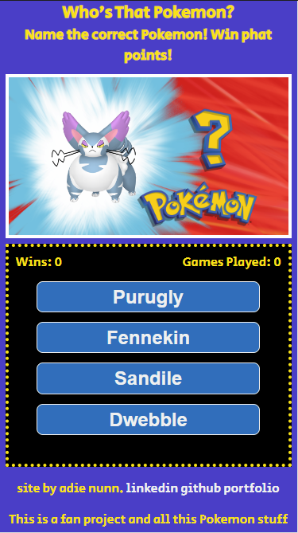

# Who's That Pokemon

Uses the Pokemon API to generate a random Pokemon. Multiple choice answers. Pick the correct Pokemon, win a point. GG EZ.

## Demo

[Live Site](https://cowtipping.co.uk/whothatpoke/)

## Motivation

This was a project made early into my bootcamp at [School Of Code](https://www.schoolofcode.com/), using vanilla JavaScript, which we learned in week 1 and using public APIs, which we learned in week 2.

I revisted those topics a few weeks later as a little refresher side-project.

## Technology

TypeScript

## API

[PokeAPI](https://pokeapi.co/)

## Installation and Setup Instructions

Clone down this repository. You will need [`node`](https://nodejs.org/en/download) and `TypeScript` installed globally on your machine. <code>npm install -g typescript</code>

#### Compile TypeScript:

`tsc`

#### To Start Server:

If using VS Code, get the [`Live Server`](https://marketplace.visualstudio.com/items?itemName=ritwickdey.LiveServer) extension.  
Click 'Go Live' in the bottom-right.  
The app will launch in your browser at `http://127.0.0.1:5500/`

## TypeScript Teachings

This is the first of my old projects I've converted to TS.

- Came across a lot of "is possibly null" errors and added error-checking for those.
- Had an issue with "property src does not exist on type 'Element'" which was fixed using type assertions (ie. trust me, bro 😎) by adding `as HTMLImageElement` after the offending sprite definition.
- The same issue also reared its ugly head as it did not like `e.target.value` so I learned I can use `(e.target as HTMLButtonElement).value` instead.
- There weren't a huge amount of changes other than those as TS was able to infer most of the types.

## Reflections

There was a really early issue in which it was making 5 calls to the API each time it was fetching the Pokemon. All it needed to do was use the randomly generated ID number and fetch the names of the corresponding Pokemon. The data coming back was way more than needed. I fixed this by generating my own data file which just has the IDs and Pokemon names in it. Although this has the downside of not being a publicly updated file, it causes less strain on a public API. Now the API is only called to fetch the 'winning' Pokemon, its name and a link to its image.  
Potential improvement: As PokeAPI is in beta for GraphQL, this is something to look into because this wee game doesn't need much info - just the name and a link to the Mon's sprite.

## TODO

- Further improvements to UI.
- Tests.
- Sound effects.
- Light/dark mode.
- Maybe some kind of 'end-game'.
- Aforementioned GraphQL conversion.
- Look into alternative sprites for Pokemon ID 905+

## Patch Notes

**21.Mar.23**  
Improved this README. 🤯

**15.Feb.23**  
Converted the project to TypeScript. ❤

**28.Jan.23**  
Moved image and answers to be side-by-side on larger screens.

**19.Dec.22**  
Fixed getting duplicate Pokemon in answers.

**8.Dec.22**  
Added patch notes. 🤣  
Updated visuals for smaller devices. Fixed some jank in the JS.
